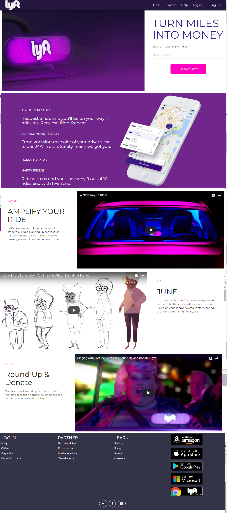

# Lyft

##Estructura de la página.

***
## Previo al código

1. Realizar un [**Repositorio en GitHub**](https://github.com/RosyG/lyft-v3)

2. Subir la estructura de carpetas con el comando `git add .`, `git commit -m "comentario"` y `git push origin master`

3. Configurar al proyecto con browserify y stylus por medio de comandos, como se muestra el paso a paso:
  - `npm init`
  - `press ok` para terminar de generar un package.json con la información agregada.
  - `npm install --save-dev browserify`
  - `npx browserify src/js/app.js -o ./public/bundle.js`
  - `npm install i -D stylus`
  - `npm run dev`

  Este ultimo comando se escribe porque previamente en el archivo package.json ya se había escrito la siguiente relación:  
   `"scripts": {
      "bundle": "browserify ./src/js/app.js -o ./public/bundle.js",
      "stylus": "stylus ./src/css/main.styl -o ./public/main.css",
      "test": "echo \"Error: no test specified\" && exit 1",
      "dev": "npm run bundle && npm run stylus"
    }`

  ## Links de videos utilizados:
  - Estos son los videos de YouTube:
    * https://www.youtube.com/watch?v=fLSmUWOYpKw
    * https://www.youtube.com/watch?v=V7j8Aqxmbs8
    * https://www.youtube.com/watch?v=gZjVSuVBiYs&feature=youtu.be
  - Para agregar los videos, se obtuvo por medio del proveedor YouTube al buscar la etiqueta `iframe` que se puede obtener dando clic en `compartir` y después en `insertar`.

  ## Herramientas tecnológicas utilizadas:

    * [Node.js](https://nodejs.org/en/), npm
    * [jQuery](http://jquery.com/download/)
    * [materialize](http://materializecss.com/)
    * [Icomoon](https://icomoon.io/)
    * [Browserify](http://browserify.org/)
    * [Stylus](http://stylus-lang.com/)

# Desarrollado para [Laboratoria](http://www.laboratoria.la/)
