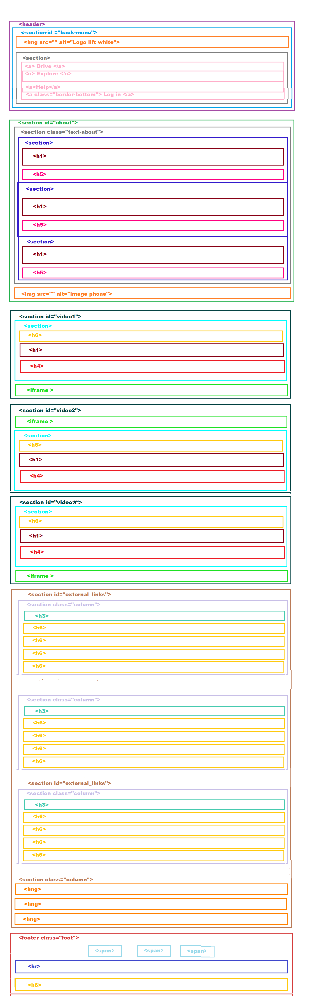

# Lyft

* **Track:** _Common Core_
* **Curso:** _Creando tu primer sitio web interactivo_
* **Unidad:** _Maquetado web con HTML & CSS_

***
## Previo al código

1. Realizar un [**fork**](https://gist.github.com/ivandevp/1de47ae69a5e139a6622d78c882e1f74)
   de este repositorio.

2. En git bash **clonar** el fork en la máquina. Usando el comando `git clone` y su estructura normalmente se ve así:

```bash
git clone https://github.com/<nombre-de-usuario>/lyft.git
```

   ## Links de videos utilizados:
  - Estos son los videos de Youtube:
    * https://www.youtube.com/watch?v=fLSmUWOYpKw
    * https://www.youtube.com/watch?v=V7j8Aqxmbs8
    * https://www.youtube.com/watch?v=xj2VWLV0xCU
  - Para agregar los videos, averigua sobre la etiqueta `iframe`.
  - Para el formulario, revisa las etiquetas como `form` e `input`.

##Estructura de las etiquetas dentro de Body.

